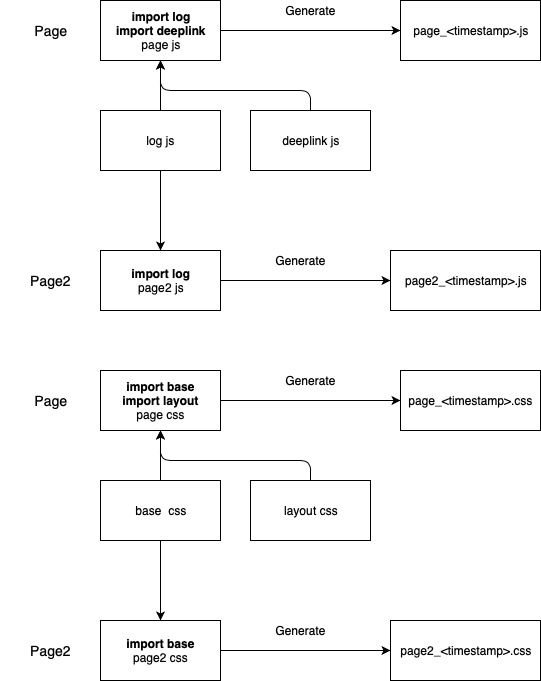

# distribute_bundled
Auto distribute bundled js for used page, not bundle together

## Feature

* Support ECMAScript import
* Support use CSS `@import` bundle
* Support CSSL4 `var`, `apply`

## Used tool

* gulp
* webpack

### plugin

* gulp
* gulp-watch
* gulp-cssnano
* gulp-cssnext
* gulp-postcss
* gulp-rename
* gulp-uglify
* gulp-cssimport
* postcss-apply
* postcss-css-variables
* autoprefixer
* webpack
* webpack-stream

## gulp

suggest version 4 up

## Webpack

suggest version 4 up

## Structure

For production is `dist`

developr is `src`

You can set up build path in `gulpfile.js`

`_common` & `_lib` put common function or library for import

css files are same as js files.



## Flow

entry

```
src/js/page.js
src/js/page2.js
```

output

```
dist/page_1573200585178.js
dist/page2_1573200585178.js
```

## Example

### JavaScript

```javascript
// _log.js
export default function log() {
  console.log('LOG2');
}

// page.js
import _log from './_common/_log';
_log();
```

### CSS

```css
/* _base.css */
.base {
  color: #777;
}


/* page.css */
@import './_common/_base.css';

.page {
  background: pink;
}
```